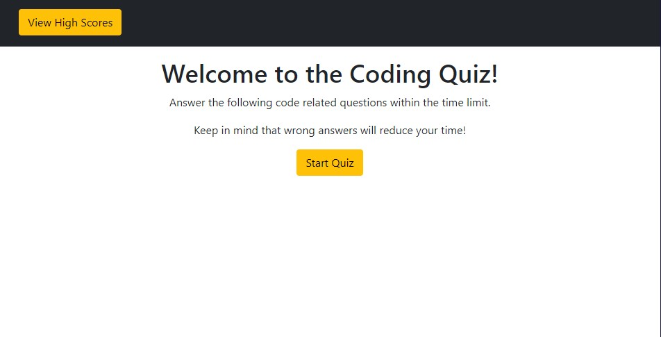
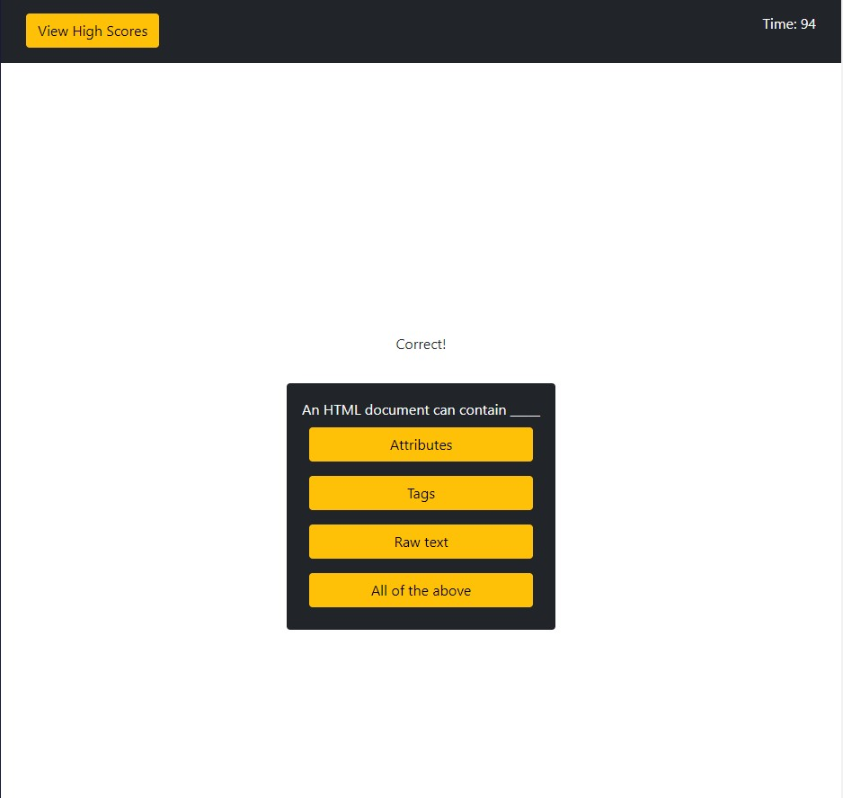
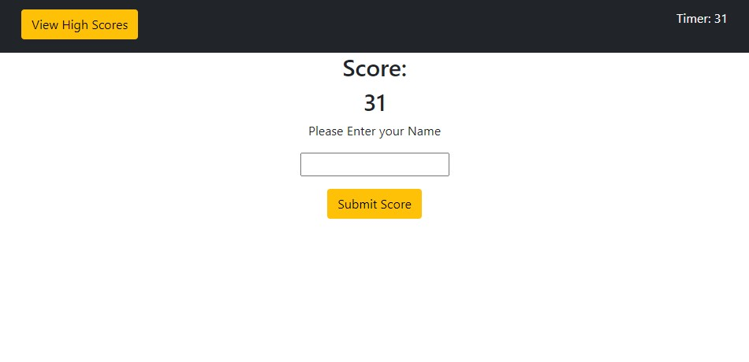
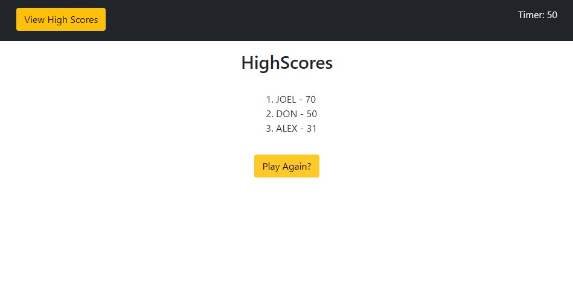

# HTML, CSS, Javascript Quiz

This is a timed quiz with HTML, CSS, and JavaScript questions. Each time you answer a question, you are presented with a new one and if you get the questoin wrong the time is reduced. When you finish the quiz or the timer runs out your time is saves and you can add it to a leaderboard stored in local memory. 

## Screenshot

## Link

https://ahageman27.github.io/coding-quiz/
